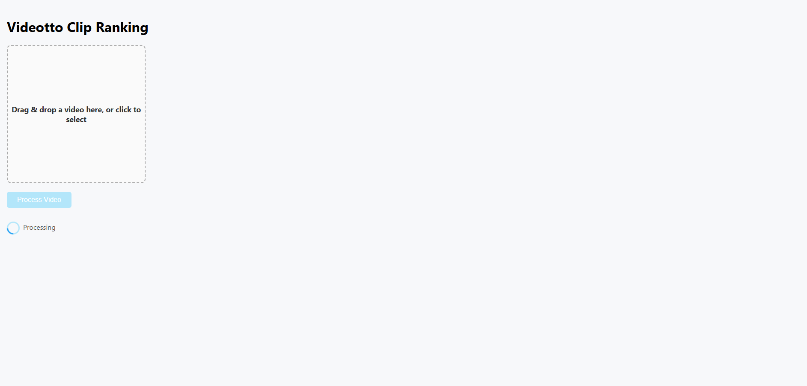
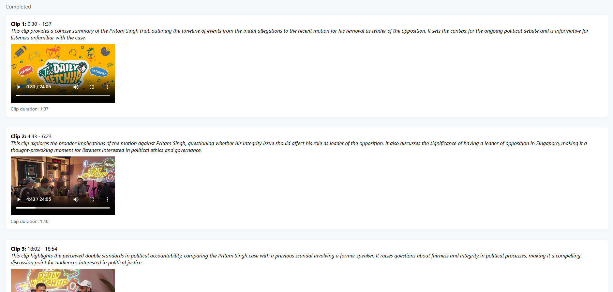

# Videotto — AI Video Clip Ranking
## Disclaimer
> ⚠️ The live web app is currently unavailable because the AWS backend instance has been turned off to save costs.  
> The source code is fully functional and can be run locally or on your own cloud instance.

## Overview
This project is a web app that automatically identifies and ranks the top 3 most interesting or shareable moments from long-form videos such as podcasts or interviews.
It prioritizes semantic relevance and narrative coherence over simple signal-based heuristics.

## How to Use?
**1. Upload a video**  
- Drag and drop your video file (MP4) into the upload area.
- Click Process Video to start.
- A progress indicator shows upload and processing status.  



**2. Results & Clip Ranking Screen**
- After processing, the app displays the top 3 clips.
- Each clip shows start/end times, a preview, and why it was selected.



**3. Play Clips**
- Click the play button to watch the clipped video segment.
- The player prevents skipping outside the clip boundaries.

## How it Works
**1. Audio Extraction**  
- The video’s audio track is extracted and downsampled to mono (12–16 kHz) to minimize processing cost.

**2. Transcription**
- Audio is transcribed using faster-whisper (tiny.en) for speed and low latency.
- Output is split into timestamped, sentence-level segments.

**3. Semantic Clip Selection**
- The full transcript is passed to an LLM (GPT-4o).
- The model is prompted to:
    - Select up to 3 interesting or shareable moments
    - Prefer complete sentences
    - Merge adjacent segments when appropriate
    - Target ~30–60s clips

**4. Post-Processing**
- Segment indices are mapped back to timestamps.
- Overlapping clips are filtered out.
- The top 3 non-overlapping clips are returned with explanations.

## Tradeoffs & Design Decisions
### Chosen Approach
The chosen approach is semantic, transcript-based ranking. This approach uses language understanding to detect insights, humor, narrative hooks, and emotionally meaningul moments. This optimizes for human-perceived value, not just activity.

### Alternatives considered
**1. Audio Energy / Speech Detection**  
- Fast but treats loudness as importance
- Misses quiet but meaningful moments

**2. Scene Changes / Visual Cues**
- Ineffective for podcasts or static interviews
- Ignores spoken content entirely

**3. Heuristics / Rule-Based Systems**
- Predictable but brittle
- Do not generalize across different speaking styles or formats

### Why they were rejected
```
“Interesting” is contextual and semantic — not something reliably captured by volume, motion, or fixed rules.
```

### Tradeoffs of the Chosen Approach
- Slower than pure signal-based methods (approximately 3.5 minutes to process a 24 minute video)
- Subjective outputs (inherent to content curation)

These tradeoffs were accepted to prioritize clip quality over raw speed.

## What I Would Improve With More Time
- Smarter clip scoring beyond pure LLM judgment. Combine LLM semantic understanding with lightweight quantitative signals

- Context-aware clip boundaries. Improve start/end detection by explicitly modeling conversational structure (setups, punchlines, conclusions) instead of relying purely on segment merges.

- Better long-form handling. Use streaming or chunked transcription with cross-chunk context to preserve narrative flow in long videos without exceeding token limits.

## Tech Stack
- Backend: FastAPI, Python
- Transcription: faster-whisper (local)
- LLM: OpenAI GPT-4o
- Frontend: React
- Media: ffmpeg